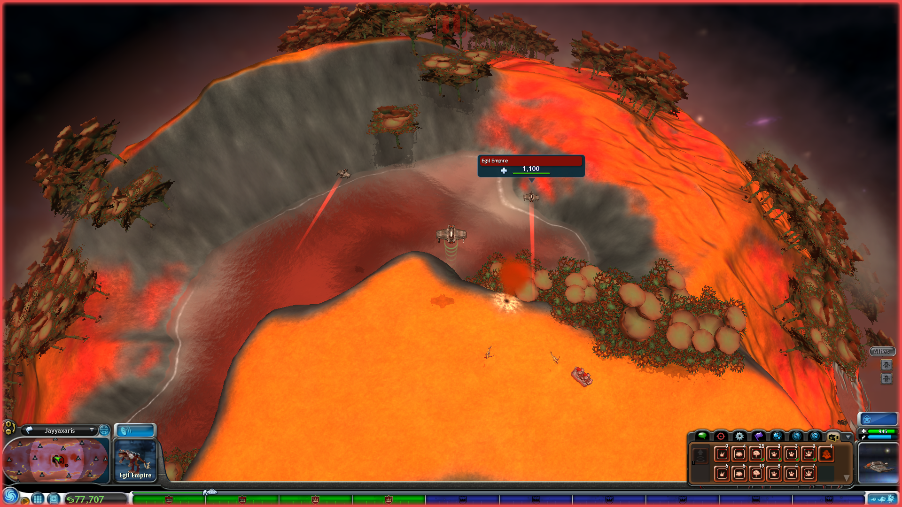

# Defensive Ships In Player Colonies
This mod adds defensive ships in player colonies, just like the AI has.

### Features

- Add defensive ships to player-controlled planets:
  - 2 ships in colonies with T0.
  - 3 ships in colonies with T > 0.
  - 5 ships in the homeworld.
- Defensive ships are replaced in case of casualties, at a rate of one ship every minute.

## Image

